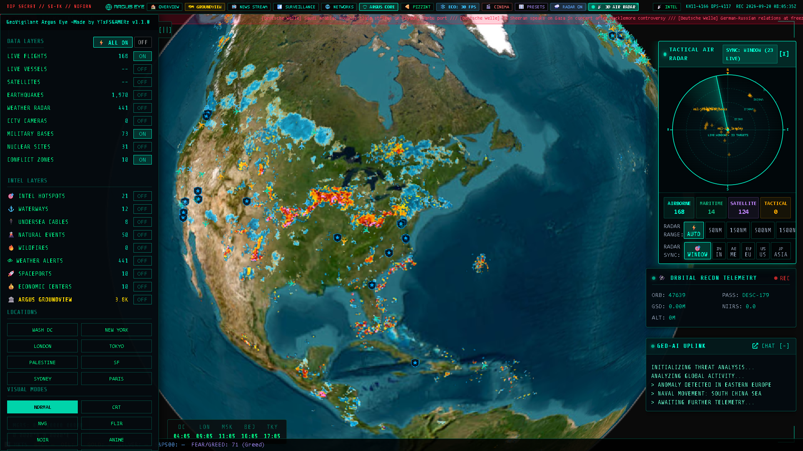
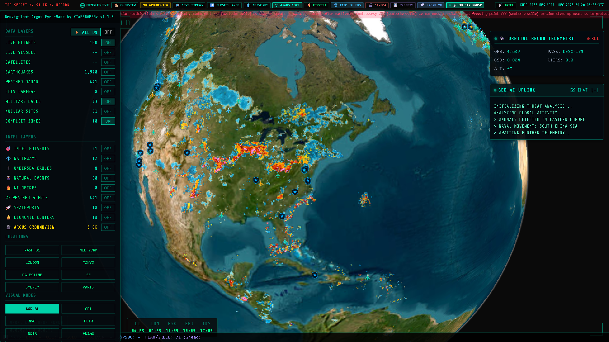
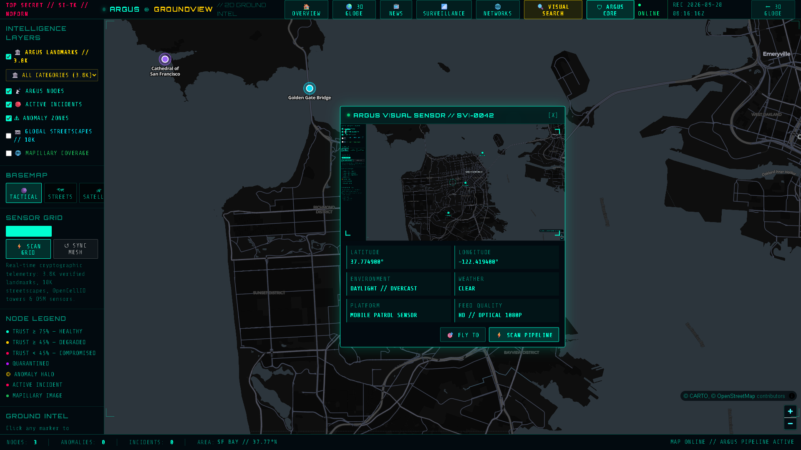
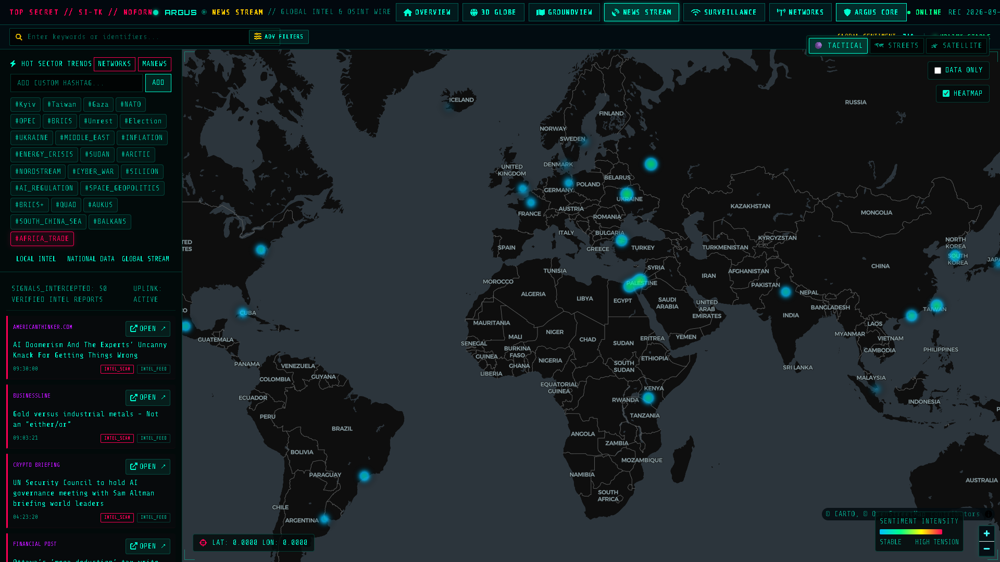
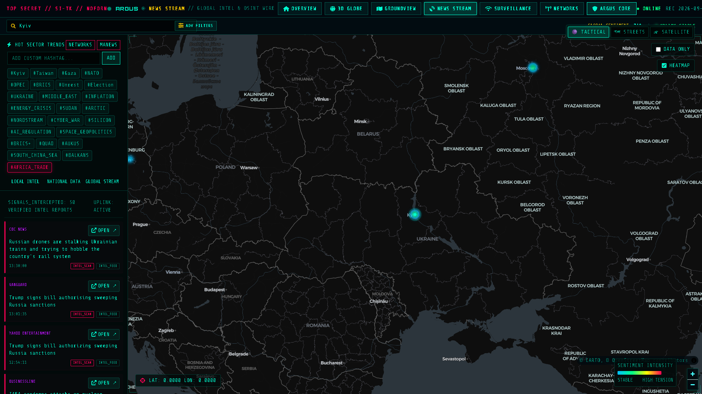
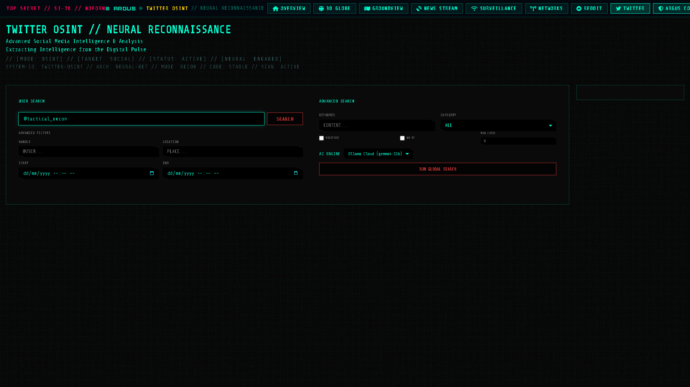
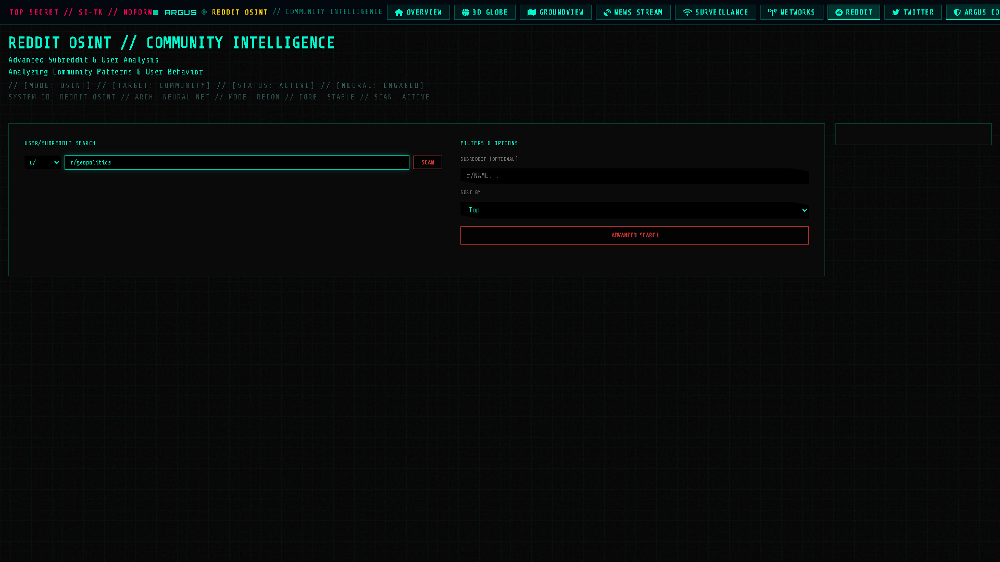

# 📖 OPERATOR_GUIDE: GEOVIGILANT ARGUS EYE MANUAL
```
================================================================================
  [ SECURE OPERATIONAL INSTRUCTIONS ] // [ FIELD MANUAL 101-G ]
================================================================================
```

This guide details keyboard shortcuts, strategic coordinate presets, 3D radar controls, GroundView operations, RF signal interception, and tactical overrides for operating the **GeoVigilant Argus Eye** platform.

---

## 1. KEYBOARD SHORTCUTS & OPERATIONAL OVERRIDES

| Key Binding | Command Trigger | Action Performed |
| :--- | :--- | :--- |
| `R` | `TOGGLE_AIR_RADAR` | Toggles the 3D rotating air surveillance radar dome and controls panel |
| `Ctrl + [` | `TOGGLE_SIDEBAR` | Collapses or expands the left tactical data layers drawer |
| `Ctrl + P` | `TOGGLE_PANOPTIC` | Activates/deactivates the AI target bounding box generator |
| `Escape` | `DISMISS_PANELS` | Closes all open popups (Radar, CCTV feed, News stream, Target info, PIZZINT) |

---

## 2. 3D AIR SURVEILLANCE RADAR OPERATIONS



The **3D Air Surveillance Radar** provides a high-density air situation picture with rotating sweep beam, true altitude drop stems, velocity vectors, and tactical range rings.

### 🎮 Radar Activation & Control Procedures
1. **Engage Radar**: Press `R` on your keyboard or click the **3D AIR RADAR** toggle in the top tactical header.
2. **Select Continental Hub**:
   - `EU EUROPE`: Centered over London / English Channel / Western Europe airspace.
   - `US AMERICAS`: Covers North America east-to-west transit corridors.
   - `ME MID EAST`: High-alert conflict surveillance sector.
   - `JP EAST ASIA`: Western Pacific / Japan / Korea maritime-air corridor.
   - `IN SOUTH ASIA`: Indian Ocean and sub-continental airspace.
   - `GLOBAL ALL`: Worldwide simultaneous multi-hub tracking.
3. **Toggle Visual Display Modes**:
   - `3D Rotating Sweep Beam`: Synchronous clockwise azimuth sweep.
   - `Altitude Drop Stems`: Vertical neon stems connecting aircraft to ground echo positions.
   - `Ground Echo Footprints`: Ground projection rings showing true sub-satellite/nadir points.
   - `Lookahead Velocity Vectors`: 5-minute projected heading and trajectory lines.
   - `Tactical Range Rings`: 50 NM, 100 NM, 200 NM, and 300 NM concentric distance markers.
4. **Adjust Vertical Elevation Scale**:
   - `1x REAL METERS`: True physical altitude proportions.
   - `3x TACTICAL`: Enhanced vertical separation for regional sector operations.
   - `5x ORBITAL`: High-contrast perspective for global orbital overviews.

---

## 3. STRATEGIC LOCATION PRESETS

Use the preset buttons in the sidebar to immediately orient the orbital camera to critical geopolitical theaters:

| Sector | Latitude | Longitude | Altitude (m) | Strategic Significance |
| :--- | :--- | :--- | :--- | :--- |
| **WASH DC** | `38.9072° N` | `77.0369° W` | `50,000` | US Political & Strategic Command Headquarters |
| **NEW YORK** | `40.7128° N` | `74.0060° W` | `50,000` | Global Financial Hub & UN Headquarters |
| **LONDON** | `51.5074° N` | `0.1278° W` | `50,000` | UK Government & European Financial Grid |
| **TOKYO** | `35.6762° N` | `139.6503° E` | `50,000` | East Asia Command & Tech Infrastructure |
| **PALESTINE** | `31.9038° N` | `35.2016° E` | `150,000` | Middle East Crisis & Conflict Monitoring Sector |
| **SF** | `37.7749° N` | `122.4194° W` | `50,000` | Silicon Valley & Pacific Naval Access |
| **SYDNEY** | `33.8688° S` | `151.2093° E` | `50,000` | Indo-Pacific Defense Command |
| **PARIS** | `48.8566° N` | `2.3522° E` | `50,000` | EU Strategic & Diplomatic Center |

---

## 4. DATA LAYER TOGGLES & TELEMETRY FEEDS



Each telemetry layer can be toggled independently via the left HUD drawer:

* 🛫 **LIVE FLIGHTS**: Global ADS-B transponders. Click any aircraft to view Callsign, ICAO24, Altitude, Velocity, Origin, and True Heading.
* 🚢 **LIVE VESSELS**: Real-time commercial, cargo, tanker, and naval vessels across maritime chokepoints.
* 🛰️ **SATELLITES**: 800+ active LEO/GEO satellites with real-time orbital tracks and SGP4 propagation.
* 🌋 **EARTHQUAKES**: USGS global seismic events with magnitude-scaled shockwave rings.
* 📡 **WEATHER RADAR**: Atmospheric radar reflectivity overlay and meteorological warnings.
* 📹 **CCTV CAMERAS**: Worldwide surveillance feeds with live video scanlines.
* 🏛️ **MILITARY BASES**: Major defense installations, naval stations, and command facilities.
* ☢️ **NUCLEAR SITES**: Commercial power reactors, enrichment facilities, and research centers.
* ⚔️ **CONFLICT ZONES**: Active geopolitical war theaters highlighted with polygon boundaries.
* 🎯 **INTEL HOTSPOTS**: Real-time geopolitical risk-assessed hotspots.
* ⚓ **WATERWAYS**: Critical maritime transit corridors (Bab el-Mandeb, Malacca, Hormuz, Suez, Panama).
* 🔌 **UNDERSEA CABLES**: Global trans-oceanic fiber-optic communications infrastructure.
* 🔥 **WILDFIRES**: NASA FIRMS thermal anomaly blooms and active fire perimeters.

---

## 5. ARGUS GROUNDVIEW: 2D TACTICAL RECONNAISSANCE



When high-speed street-level intelligence is required, navigate to **GroundView** (`/ground`):

1. **Access GroundView**: Click **GROUNDVIEW** in the top navigation header or visit `/ground`.
2. **Select Basemap Layer**:
   - `TACTICAL`: Ultra-clean high-contrast dark vector map optimized for night operations.
   - `STREETS`: Detailed road networks, street names, and building footprints.
   - `SATELLITE`: Photorealistic high-resolution aerial imagery.
3. **Interrogate SVI Camera Sensors**:
   - Click any camera node marker to open the centered **SVI Optical Sensor Modal**.
   - Inspect high-resolution street-level photography, coordinates, timestamp, and feed quality.
   - Click **`FLY TO`** to center map perspective or **`SCAN PIPELINE`** to trigger algorithmic verification.

---

## 6. RF SURVEILLANCE & WIRELESS INTERCEPT


The RF Surveillance dashboard (`/surveillance`) maps wireless signals and provides access to dark web OSINT:

1. **Sensor Mode Selection**: Toggle between `WIFI UPLINK` and `BT SCAN`.
2. **Hardware Filters**: Filter visible emitters by device class (`WIFI`, `BLUETOOTH`, `CCTV/CAM`, `DASHCAM`, `SMART_TV`, `VEHICLE`, `AUDIO`).
3. **System 07 Deep OSINT & Tor Reconnaissance**:
   - Input onion search query, breach leak keyword, or crime indicator in the reconnaissance box.
   - Select query trigger: `.ONION` (Dark Web), `LEAKS` (Credential Dumps), `CRIMES` (Police/Sanctions), or `PHOTO` (Visual Recon).
   - View live intercepted nodes in the right-side **SIGNAL MATRIX**.

---

## 7. GEOPOLITICAL INTELLIGENCE & SOCIAL OSINT RECONNAISSANCE

The Geopolitical News & Social Reconnaissance modules provide real-time situational awareness during developing international crises:

1. **Geopolitical Crisis Stream (`/news`)**:
   - Live interactive crisis mapping with automated news cluster aggregation.
   - Sentiment analysis heatmaps, hot hashtag extraction, and impact scoring.
   - Click any crisis marker or news card to center the map and view breaking source telemetry.

| Geopolitical Crisis Map & Sentiment Matrix | Active Sector Tactical Intercept |
| :---: | :---: |
|  |  |

2. **Social Media Neural Reconnaissance**:
   - **Twitter / X OSINT (`/social/twitter`)**: Target handle lookup, keyword monitoring, timeline sentiment analysis, and AI persona profiling.
   - **Reddit Community OSINT (`/social/reddit`)**: Subreddit thread scraping, emerging crisis chatter tracking, and user dossier generation.

| Twitter / X Neural Reconnaissance | Reddit OSINT Community Intelligence |
| :---: | :---: |
|  |  |

---

## 8. PIZZINT: PENTAGON PIZZA INDEX MONITORING

Click the **PIZZINT** button in the top header to inspect real-time late-night food delivery surges at major US intelligence centers (Pentagon, Langley CIA, Fort Meade NSA). Sudden spikes indicate emergency geopolitical operations underway.

---

## 9. QUICK FIELD LAUNCH (ZERO CONFIGURATION)

> [!TIP]
> **Zero API Keys Required**: All field operations (3D globe, flight radar, marine AIS, satellites, earthquakes, wildfires, weather alerts, GroundView 2D) run with **zero external API keys**. All data feeds connect to public open protocols or built-in relays.

* **Windows**: Double-click **`start.bat`** (Options: `1` for Eco Mode, `2` for 60 FPS Performance Mode, `3` for Standalone Flask).
* **Linux / macOS**: Run `./start.sh` or `python app.py`.
* **Access Console**: Open **`http://localhost:5000/`** (or `:5173` in Eco/Dev Mode).
* **Optional API Keys**: To configure custom cloud LLMs or dedicated commercial keys, copy `.env.example` to `.env` (`cp .env.example .env`). The platform automatically loads `.env` upon launch.

---

```
================================================================================
  [ END OF FIELD MANUAL ] // [ GEOVIGILANT ARGUS EYE ]
================================================================================
```
