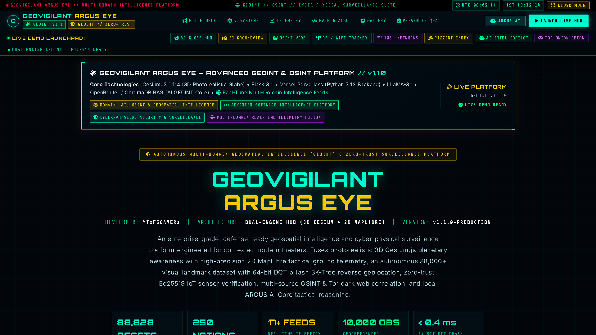

# 🌍 GEOVIGILANT ARGUS EYE
```
================================================================================
  [ SECURE UPLINK ESTABLISHED ] // [ AUTH: OPERATOR_LEVEL_5 ] // [ KH11-OPS-4117 ]
================================================================================
   ____             __     ___       _ _                 _        _                          
  / ___| ___  ___   \ \   / (_) __ _(_) | __ _ _ __  | |_     / \   _ __ __ _ _   _ ___ 
 | |  _ / _ \/ _ \   \ \ / /| |/ _` | | |/ _` | '_ \ | __|   / _ \ | '__/ _` | | | / __|
 | |_| |  __/ (_) |   \ V / | | (_| | | | (_| | | | || |_   / ___ \| | | (_| | |_| \__ \
  \____|\___|\___/     \_/  |_|\__, |_|_|\__,_|_| |_| \__| /_/   \_\_|  \__, |\__,_|___/
                               |___/                                    |___/            
================================================================================
  // CLASSIFICATION: TOP SECRET // SI-TK // NOFORN // PROJECT: ARGUS EYE v1.1.0
  // DEVELOPER: YTxFSGAMERz
================================================================================
```

[](https://geovigilant-argus.vercel.app/)
[](https://github.com/YTxFSGAMERz/GeoVigilant-Argus)
[](./LICENSE.md)
[](https://cesium.com)
[](https://maplibre.org/)
[](https://flask.palletsprojects.com/)
[](https://geovigilant-argus.vercel.app/)

> **[OPERATIONAL DIRECTIVE]**: **GeoVigilant Argus Eye** is an enterprise-grade geospatial intelligence (GEOINT), cyber-physical surveillance, and multi-domain OSINT reconnaissance platform. It seamlessly fuses live military and commercial ADS-B flight transponders, real-time AIS maritime fleets, orbital satellite positions, USGS seismic telemetry, thermal wildfire perimeters, CCTV surveillance nodes, undersea fiber-optic cables, and geopolitical crisis zones onto a photorealistic 3D Cesium globe and an ultra-low-latency 2D MapLibre tactical workspace.

---

## 📸 SYSTEM SHOWCASE & OPERATIONAL SCREENSHOTS

### 🛰️ 1. Multi-Domain Intelligence Suite & Command Overview
The central command hub connecting all geospatial intelligence engines, real-time sensor grids, and zero-trust IoT telemetry networks.



---

### 📡 2. 3D Air Surveillance Radar & Tactical Multi-Layer HUD
Real-time 3D tactical radar with rotating sweep beam, true altitude drop stems, velocity vectors, and 16 active real-time telemetry layers.


---

### 🌍 3. Photorealistic 3D Cesium Planetary Reconnaissance
Full-spectrum satellite basemap with global ADS-B flight tracks, LEO/GEO satellite orbits, live world clocks, and the real-time **GEO-AI UPLINK** threat matrix.


---

### 🗺️ 4. ARGUS GroundView: 2D Tactical Intelligence & SVI Camera Sensor Inspection
Dedicated 2D MapLibre workspace for street-level intelligence, high-density asset clustering, and Street View Imagery (SVI) sensor interrogation.

| Tactical Ground Sensor Mesh | SVI Optical Camera Inspection Modal |
| :---: | :---: |
|  |  |

---

### 📶 5. RF Surveillance, Wireless Intercept & Deep Dark Web OSINT
Geolocated WiFi BSSID/SSID tracking, OpenCellID mobile tower triangulation, and integrated Tor SOCKS5 dark web onion search.


---

### 📰 6. Geopolitical Intelligence Stream & Social Reconnaissance
Real-time crisis monitoring, sentiment analysis, hot sector trending hashtags, active crisis sector interrogation, and neural social media reconnaissance across Twitter/X and Reddit.

| Geopolitical Crisis Map & Sentiment Matrix | Active Sector Tactical Intercept |
| :---: | :---: |
|  |  |

| Twitter / X Neural Reconnaissance | Reddit OSINT & Community Intelligence |
| :---: | :---: |
|  |  |

---

## 🌐 PRODUCTION UPLINKS & WORKSPACES

| Interface | Route | Primary Engine | Purpose |
| :--- | :--- | :--- | :--- |
| 🎛️ **Command Suite** | [`/`](https://geovigilant-argus.vercel.app/) | HTML5 / Vite HUD | Flagship executive portfolio, system index, and telemetry metrics |
| 🌍 **3D Earth HUD** | [`/earth`](https://geovigilant-argus.vercel.app/earth) | CesiumJS 1.114 | Planetary 3D visualization, 16 live telemetry feeds, GLSL shaders, 3D Air Radar |
| 🗺️ **GroundView 2D** | [`/ground`](https://geovigilant-argus.vercel.app/ground) | MapLibre GL JS | High-speed 2D ground surveillance, Mapillary SVI street inspection, 88K+ visual landmarks |
| 📶 **RF Surveillance** | [`/surveillance`](https://geovigilant-argus.vercel.app/surveillance) | Leaflet / Google Maps | WiGLE WiFi mapping, OpenCellID cell towers, Tor Onion search, and crime recon |
| 📰 **News Intelligence** | [`/news`](https://geovigilant-argus.vercel.app/news) | Leaflet / Carto Dark | Geopolitical event mapping, regional crisis streams, sentiment analysis |
| 🐦 **Twitter OSINT** | [`/social/twitter`](https://geovigilant-argus.vercel.app/social/twitter) | Tactical Form HUD | Neural user search, keyword sentiment tracking, timeline OSINT |
| 🤖 **Reddit OSINT** | [`/social/reddit`](https://geovigilant-argus.vercel.app/social/reddit) | Tactical Form HUD | Subreddit intelligence, thread scraping, community behavior analysis |

---

## ⚡ ARCHITECTURE & CORE CAPABILITIES

```
[GEOVIGILANT ARGUS SYSTEM ARCHITECTURE]
 ├── 🌍 3D PLANETARY ENGINE       : CesiumJS 1.114 (ArcGIS World Imagery + 3D Terrain + OSM Buildings)
 ├── 🗺️ 2D TACTICAL ENGINE        : MapLibre GL JS (Vector Carto Basemaps + Mapillary SVI Layer)
 ├── 📡 3D AIR SURVEILLANCE RADAR : Real-time rotating sweep beam, drop stems, 6 continental hubs
 ├── 🖥️ CYBERPUNK HUD DESIGN     : 1,300+ lines custom CSS, responsive panels, telemetry clocks, HUD audio
 ├── 🚀 SERVERLESS API RUNTIME    : Flask 3.1 WSGI + Python 3.12 Serverless Functions on Vercel
 ├── ✈️ GLOBAL FLIGHT TRACKING    : Multi-hub ADS-B radar (OpenSky Network + regional aggregators)
 ├── 🚢 MARITIME VESSEL FLEET     : Live AIS WebSocket stream (AISstream.io) + global sea lane corridors
 ├── 🛰️ ORBITAL ASSET MATRIX     : 800+ Live LEO/GEO Satellites via SatNOGS DB / CelesTrak TLE
 ├── 🌋 REAL-TIME SEISMIC GRID   : Instantaneous Global Earthquake Telemetry via USGS GeoJSON
 ├── 📹 SURVEILLANCE CCTV NETWORK : Global Camera Feeds with Real-Time Analog Scan Overlay
 ├── 📶 RF & WIRELESS SURVEILLANCE: WiGLE WiFi networks, OpenCellID cell towers, Bluetooth beacons
 ├── 🤖 GEO-AI RECON ASSISTANT   : LLaMA-3.1 / OpenRouter / Hugging Face + ChromaDB RAG Vector Memory
 └── 🕵️ MULTI-SOURCE OSINT & TOR  : Clearnet Aggregator (DDG/Bing/Google) + Tor Onion Search Proxy
```

---

## 📡 REAL-TIME DATA FEEDS

The tactical console tracks and renders 16 simultaneous telemetry data feeds:

| Layer | Node Source | Description |
| :--- | :--- | :--- |
| 🛫 **Live Flights** | OpenSky Network & Multi-Hub | Worldwide ADS-B transponder telemetry with altitude, true heading, and squawk alert detection |
| 🚢 **Live Vessels** | AISstream.io & Maritime Fleet | Real-time container ships, tankers, cargo, and naval vessels across maritime chokepoints |
| 🛰️ **Satellites** | SatNOGS & CelesTrak | 800+ active satellites calculated via orbital parameters (TLE) and SGP4 orbital propagation |
| 🌋 **Earthquakes** | USGS Earthquake API | Real-time global seismic events with magnitude-scaled shockwave rings and hypocenter depth |
| 📡 **Weather Radar** | Open-Meteo & NOAA NWS | Live precipitation levels, atmospheric pressure, and severe county warnings |
| 📹 **CCTV Cameras** | Global Surveillance Nodes | Worldwide traffic and security cameras with live modal video overlays |
| 🏛️ **Military Bases** | Global GeoINT DB | Strategic defense installations, naval stations, and command headquarters |
| ☢️ **Nuclear Sites** | IAEA Open Geodata | Global nuclear power plants, enrichment facilities, and storage depots |
| ⚔️ **Conflict Zones** | ACLED / Conflict Intel | Active geopolitical war theaters (Gaza, Ukraine, Strait of Hormuz, Sudan, Red Sea) |
| 🎯 **Intel Hotspots** | Strategic Risk Matrix | Real-time risk-assessed hotspots classified by threat severity level |
| ⚓ **Strategic Waterways** | Maritime Chokepoints | Critical maritime transit corridors (Bab el-Mandeb, Malacca, Hormuz, Suez, Panama) |
| 🔌 **Undersea Cables** | Submarine Telecom DB | Trans-oceanic fiber-optic communications cables powering global internet traffic |
| 🔥 **Wildfires** | NASA FIRMS (VIIRS/MODIS) | Real-time thermal anomaly blooms and active wildfire perimeter tracking |
| 🌪️ **Natural Events** | NASA EONET | Severe storms, active volcanoes, sea/lake ice floes, and natural hazards |
| 🚀 **Spaceports** | Orbital Launch DB | Global space launch complexes (Cape Canaveral, Baikonur, Kourou, Tanegashima) |
| 💰 **Economic Centers** | Global Financial Matrix | Major stock exchanges, trading hubs, and central financial districts |

---

## 👁️ GLSL OPTICAL FILTERS (SENSOR MODES)

The 3D globe features hardware-accelerated **GLSL (OpenGL Shading Language)** post-processing fragment shaders:

```
[GLSL SENSOR MODES]:
 ├── NORMAL : Full-spectrum photorealistic ArcGIS Earth satellite imagery.
 ├── CRT    : Vintage surveillance monitor with phosphor scanlines and chromatic aberration.
 ├── NVG    : Gen-3 Night Vision Goggles with green-phosphor luminance mapping and ISO sensor noise.
 ├── FLIR   : Forward-Looking Infrared mapping luminance across a 4-band thermal spectrum.
 ├── NOIR   : High-contrast monochrome surveillance overlay with edge vignetting.
 ├── ANIME  : Sobel edge-detection filter with color-quantization comic outlines.
 └── SNOW   : Severe winter atmospheric conditions simulator with blizzard noise grain.
```

---

## 🧠 ADVANCED TACTICAL MODULES

### 📡 3D AIR SURVEILLANCE RADAR
Press `R` to engage the rotating 3D air radar dome. Projects true spherical-to-Cartesian altitude drop stems, velocity vectors, and concentric range rings (50–300 NM) across 6 switchable continental radar hubs (Americas, Europe, East Asia, Middle East, South Asia, Global).

### 🔲 PANOPTIC A.I. OBJECT DETECTION
Activating **AI Panoptic Mode** triggers a real-time scanning sweep. The targeting core renders dynamic HUD bounding boxes around planetary coordinates, classifying anomalies into `Vehicle`, `Aircraft`, `Vessel`, `Building`, or `Personnel` with computed confidence ratings.

### 📶 GEO-AI UPLINK (THREAT MATRIX)
A context-aware geospatial AI responding to cursor movement over planetary coordinates. Evaluates regional threat indicators on a localized 2° grid and displays real-time telemetry: *Naval Movement*, *Encrypted Comm Burst*, *Thermal Bloom*, or *Troop Buildup*.

### 🍕 PIZZINT (PENTAGON PIZZA INDEX)
A real-time status monitoring panel tracking late-night pizza delivery surges at US intelligence headquarters (Arlington Pentagon HQ, Langley CIA, and Fort Meade NSA) as a leading proxy for impending geopolitical operations.

---

## 📂 REPOSITORY ARCHITECTURE

```
GeoVigilant-Argus/
├── api/
│   └── index.py               # WSGI serverless entrypoint for Vercel Python runtime
├── globe/                     # Standalone 3D Cesium Subsystem
│   ├── index.html             # Standalone 3D globe entrypoint
│   ├── src/globe.js           # Terra5Globe Cesium controller & GLSL shader pipeline
│   ├── src/main.js            # AppController state management, polling, & UI bindings
│   └── src/services/          # Telemetry API clients & GeoJSON datasets
├── static/
│   ├── css/
│   │   ├── globe-style.css    # Primary tactical HUD layout, panels, and responsiveness
│   │   └── cyberpunk.css      # Cyberpunk visual styles, neon borders, and animations
│   └── js/
│       ├── globe.js           # Compiled 3D globe engine
│       └── globe-main.js      # Compiled frontend application controller
├── templates/
│   ├── portfolio.html         # Executive command suite & showcase overview (/)
│   ├── earth.html             # Master 3D Earth HUD template (/earth)
│   ├── groundview.html        # ARGUS GroundView 2D intelligence template (/ground)
│   ├── wifi-search.html       # RF & WiFi surveillance template (/surveillance)
│   ├── news.html              # Geopolitical intelligence stream template (/news)
│   └── social/                # Social media OSINT templates (Twitter, Reddit)
├── screenshots/               # High-resolution tactical screenshots & UI captures
├── ARGUS_DATASET/             # Verified 88K+ landmark & streetscape image dataset
│   ├── reports/final_report.md# Autonomous acquisition & verification audit report
│   └── geodata/               # GeoJSON boundaries, military sites, cables, waterways
├── app.py                     # Core Flask application, REST APIs, & OSINT endpoints
├── Socio.py                   # Social media OSINT, Twitter API v2, & sentiment analysis
├── news_config.py             # Global news feeds and geopolitical RSS feeds configuration
├── vercel.json                # Vercel serverless routing, rewrite rules, and static routing
├── requirements.txt           # Optimized lightweight Python dependencies
└── package.json               # Vite build pipeline and frontend dependencies
```

---

## 🚀 QUICK START & INSTALLATION

> [!TIP]
> ### ⚡ ZERO API KEYS REQUIRED TO RUN!
> **You do NOT need to obtain or configure ANY API keys to run GeoVigilant Argus Eye.**
> The platform is engineered to work **100% out-of-the-box**. All primary surveillance and telemetry systems run immediately using free public feeds, built-in telemetry proxies, and local heuristics:
> * 🛫 **Live ADS-B Flights**: Real-time OpenSky Network transponders (Free / Public, No Key Needed)
> * 🚢 **Live Maritime Vessels**: Pre-configured global AISstream vessel proxy (Built-In Key, No Setup)
> * 🛰️ **Orbiting Satellites**: CelesTrak & SatNOGS TLE orbital propagation (Free / Public, No Key Needed)
> * 🌋 **Earthquake Sensors**: USGS Global Seismic Network (Free / Public, No Key Needed)
> * 📡 **Weather Radar & Alerts**: NOAA NWS & Open-Meteo atmospheric radar (Free / Public, No Key Needed)
> * 🔥 **Thermal Wildfires**: NASA FIRMS VIIRS/MODIS satellite blooms (Free / Public, No Key Needed)
> * 🌪️ **Natural Disasters**: NASA EONET hazard events (Free / Public, No Key Needed)
> * 🗺️ **3D & 2D Basemaps**: ArcGIS Photorealistic Imagery & CartoDB Dark Matter (Free / Public, No Key Needed)
> * 📹 **Global CCTV**: Public traffic & security camera network (Free / Public, No Key Needed)
> * 🏛️ **Defense & GeoINT**: Military bases, nuclear sites, undersea cables, waterways (Built-in GeoData)
> * 📰 **Geopolitical News**: 50+ regional RSS news feeds + GDELT crisis stream (Free / Public, No Key Needed)
> * 🤖 **Tactical AI Core**: Local Ollama integration or built-in deterministic heuristic analysis (No Key Needed)

---

### ⚡ Option A: 1-Click Launch (Easiest)

#### 🪟 Windows (1-Click)
Simply double-click **`start.bat`** in the project folder (or run `.\start.bat` in PowerShell/CMD).
* Automatically detects your Python runtime and virtual environment.
* Automatically verifies dependencies.
* Displays an interactive tactical launcher menu (Eco Mode, 60 FPS Performance Mode, or Standalone Flask).
* Automatically launches your browser at **`http://localhost:5000/`**.

#### 🐧 Linux & 🍎 macOS (1-Command)
Run the unified shell launcher:
```bash
chmod +x start.sh
./start.sh
```

---

### 📦 Option B: Manual Setup (3 Simple Commands)

If you prefer to run standard terminal commands:

#### 1. Clone the Repository
```bash
git clone https://github.com/YTxFSGAMERz/GeoVigilant-Argus.git
cd GeoVigilant-Argus
```

#### 2. Install Python Dependencies
```bash
pip install -r requirements.txt
```

#### 3. Run the Application
```bash
python app.py
```
Open **`http://localhost:5000/`** in your browser!

> [!NOTE]
> **Do I need Node.js or npm?**
> **No!** All frontend bundles (`globe-main.js`) are **already pre-compiled and included** in `static/js/`. You only need Node.js / `npm` if you are actively modifying the frontend source code and running the Vite HMR dev server (`npm run dev`).

---

### ⚙️ How to Configure Optional API Keys

To add your own optional API keys securely without putting them in the codebase:

1. **Copy `.env.example` to `.env`**:
   ```bash
   cp .env.example .env
   ```
   *(On Windows Command Prompt, run: `copy .env.example .env`)*

2. **Open `.env` and fill in any optional provider keys**:
   ```env
   # Server & Operational Security (Optional overrides)
   HOST=127.0.0.1
   PORT=5000
   SECRET_KEY=your_custom_secret_key

   # Optional: Cloud AI Reasoning (Defaults to Local Ollama / Built-in Heuristics if omitted)
   OPENROUTER_API_KEY=your_openrouter_key
   ANTHROPIC_AUTH_TOKEN=your_anthropic_token
   HF_TOKEN=your_huggingface_token

   # Optional: Commercial & Telemetry Overrides (Built-in free fallbacks used if omitted)
   OPENCELLID_API_KEY=your_custom_opencellid_key
   AIS_API_KEY=your_custom_aisstream_key
   NEWS_API_KEY=your_custom_newsapi_key
   WIGLE_API_NAME=your_wigle_name
   WIGLE_API_TOKEN=your_wigle_token
   MACVENDORS_TOKEN=your_macvendors_token

   # Optional: Live Twitter/X API v2 Dev Access
   TWITTER_API_KEY=your_key
   TWITTER_API_SECRET=your_secret
   TWITTER_BEARER_TOKEN=your_token

   # Optional: Discord Bot & Alerts
   DISCORD_BOT_TOKEN=your_bot_token
   DISCORD_CHANNEL_ID=your_channel_id
   ```

3. **Launch the Platform**:
   The platform automatically loads `.env` upon startup!

> [!NOTE]
> Again, **everything runs out-of-the-box without configuring `.env`**. Optional keys simply unlock private high-rate-limit commercial endpoints and custom cloud LLMs.

---

## 🌐 PRODUCTION DEPLOYMENT (VERCEL + RENDER)

GeoVigilant Argus Eye uses a high-performance decoupled cloud architecture:
* **Vercel**: Hosts the static multi-page frontend (`dist/`), Cesium 3D HUD, and 2D GroundView at edge latency.
* **Render**: Hosts the Flask 3.1 WSGI backend API via Gunicorn with real-time live telemetry proxies and OSINT engines.
* **Database**: Runs on lightweight embedded SQLite caches (`geosent.db`, `socio.db`). Zero paid or external database servers required.

```
[VERCEL EDGE FRONTEND]  ---- HTTPS API Calls (VITE_API_URL) ---->  [RENDER BACKEND API]
(dist/ static distribution)                                          (Gunicorn 0.0.0.0:$PORT)
                                                                               │
                                                                   [EXTERNAL DATA SOURCES]
                                                                (OpenSky, USGS, NASA, AIS, etc.)
```

### 🛠️ Step 1: Deploy Backend on Render

1. Log in to your [Render Dashboard](https://dashboard.render.com/) and click **New +** → **Web Service** (or use **Blueprint** pointing to `render.yaml`).
2. Connect your GitHub repository `YTxFSGAMERz/GeoVigilant-Argus`.
3. Configure service parameters:
   * **Name**: `geovigilant-argus-api`
   * **Environment**: `Python`
   * **Region**: Oregon (or nearest)
   * **Branch**: `main`
   * **Build Command**: `pip install -r requirements.txt`
   * **Start Command**: `gunicorn app:app --bind 0.0.0.0:$PORT --workers 1 --threads 4 --timeout 120`
   * **Plan**: `Free`
4. Under **Advanced** → **Health Check Path**, set `/health`.
5. Add Environment Variables:
   * `PYTHON_VERSION`: `3.12.0`
   * `FLASK_DEBUG`: `false`
   * `HOST`: `0.0.0.0`
   * `SECRET_KEY`: `<generate-a-random-hex-string>`
   * *(Optional)* Add any telemetry API keys (e.g. `OPENCELLID_API_KEY`, `AIS_API_KEY`, `OPENROUTER_API_KEY`).
6. Click **Create Web Service**. Wait for the build to complete and copy your live backend URL (e.g., `https://geovigilant-argus-api.onrender.com`).

### ⚡ Step 2: Deploy Frontend on Vercel

1. Log in to [Vercel](https://vercel.com/) and click **Add New...** → **Project**.
2. Import the `YTxFSGAMERz/GeoVigilant-Argus` repository.
3. Configure build & deployment settings:
   * **Framework Preset**: `Vite`
   * **Root Directory**: `./` (leave default)
   * **Build Command**: `npm run build`
   * **Output Directory**: `dist`
4. Under **Environment Variables**, add:
   * `VITE_API_URL`: `https://your-render-service.onrender.com` (use your actual Render URL from Step 1)
5. Click **Deploy**. Vercel will run `npm run build`, assemble `dist/`, and provision your production URL (e.g., `https://geovigilant-argus.vercel.app`).

### 🔗 Step 3: Configure Cross-Origin Synchronization (CORS)

1. Return to your Render Dashboard for `geovigilant-argus-api`.
2. Under **Environment Variables**, set:
   * `FRONTEND_URL`: `https://geovigilant-argus.vercel.app` (your actual Vercel domain)
3. Trigger a manual deploy (or Render will automatically restart with the new variable).
4. Now your frontend on Vercel and backend on Render can securely communicate with CORS credentials enabled.

### 🩺 Health & Verification Endpoints

* **Render Health Check**: `GET https://your-backend.onrender.com/health` → `{"status": "ok"}`
* **System Telemetry**: `GET https://your-backend.onrender.com/api/sys/memory`
* **Local Test Suite**:
  ```bash
  npm test        # Vitest pipeline and cryptographic unit tests
  npm run build   # Production Vite bundle and dist/ assembly
  ```

### 💡 Known Free-Tier Characteristics

* **Render Cold Starts**: On Render's free tier, inactive services spin down after 15 minutes of inactivity. The first request after spindown may take 30–50 seconds to boot the Python environment.
* **Vercel Edge**: The frontend runs 24/7 with 0ms cold start latency on the Vercel Edge Global CDN.
* **Cost**: $0.00 / month forever.

---

## ⌨️ OPERATOR KEYBOARD SHORTCUTS

| Shortcut | Command | Action |
| :--- | :--- | :--- |
| `R` | `TOGGLE_AIR_RADAR` | Activates / deactivates the 3D rotating air surveillance radar dome |
| `Ctrl + [` | `TOGGLE_SIDEBAR` | Collapses / expands the tactical layers control drawer |
| `Ctrl + P` | `TOGGLE_PANOPTIC` | Activates / deactivates the AI target bounding box generator |
| `Escape` | `DISMISS_PANELS` | Closes all open modals (Radar, CCTV, News, Target Info, PIZZINT) |

---

## 📜 DOCUMENTATION DIRECTORY

* 📊 **[SYSTEM_SPEC.md](./SYSTEM_SPEC.md)**: Mathematical models, shader pipelines, 3D radar trigonometry, and architecture specifications.
* 📖 **[OPERATOR_GUIDE.md](./OPERATOR_GUIDE.md)**: Field operating manual, HUD controls, SVI sensor inspection, and coordinate directory.
* 🎯 **[docs/presentation_guide.md](./docs/presentation_guide.md)**: Complete pitch manual, problem-solution matrix, and demo script.
* 🤖 **[docs/geovigilant_ai.md](./docs/geovigilant_ai.md)**: GeoVigilant AI GEOINT assistant, RAG architecture, and command tags.
* 🔍 **[docs/search_options.md](./docs/search_options.md)**: Clear-net OSINT, dark web Tor integration, and social search.
* 🔎 **[docs/criminal_recon_manual.md](./docs/criminal_recon_manual.md)**: Crime record search, police data ingestion, and biometrics roadmap.
* 🌍 **[globe/README.md](./globe/README.md)**: Isolated 3D Cesium globe subsystem and Vite build toolchain.
* 📁 **[ARGUS_DATASET/reports/final_report.md](./ARGUS_DATASET/reports/final_report.md)**: 88K+ landmark & streetscape imagery acquisition benchmark.
* 🔒 **[SECURITY.md](./SECURITY.md)**: Security policy and vulnerability disclosure procedures.
* 🤝 **[CONTRIBUTING.md](./CONTRIBUTING.md)**: Contribution guidelines and code standards.

---

## 📄 LICENSE

Distributed under the **MIT License**. See [`LICENSE.md`](./LICENSE.md) for full details.

```
================================================================================
  [ END OF TRANSMISSION ] // [ GEOVIGILANT ARGUS EYE READY ]
================================================================================
```
