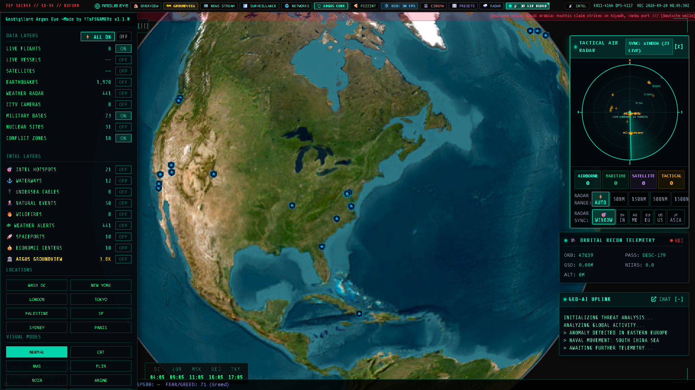
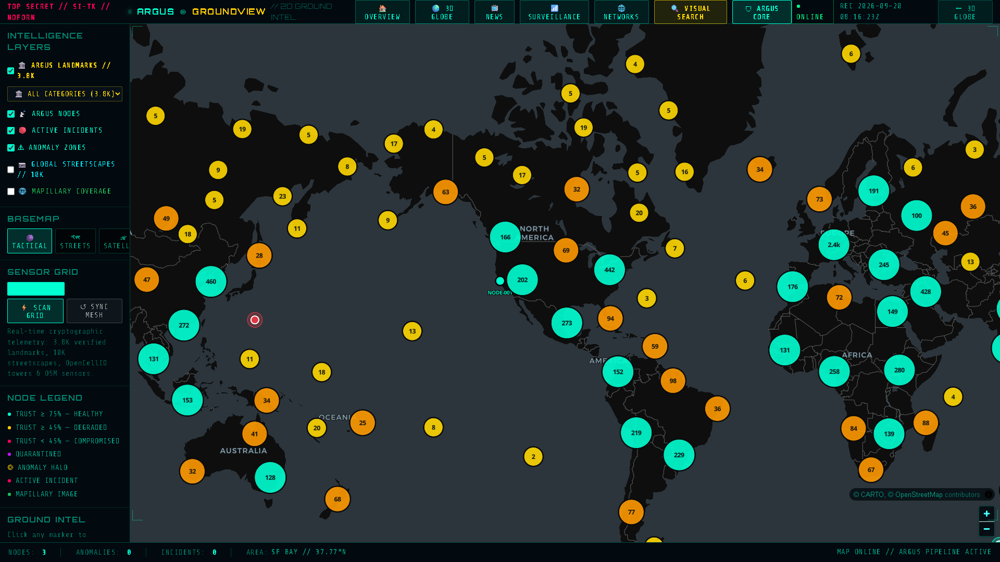

# 📊 SYSTEM_SPEC: GEOVIGILANT ARGUS EYE SPECIFICATIONS
```
================================================================================
  [ SECURE TECHNICAL DOCUMENTATION ] // [ LEVEL 5 ACCESS REQUIRED ]
================================================================================
```

This document details the software engineering specifications, mathematical algorithms, rendering architecture, 3D radar trigonometry, perceptual hashing indexing, and post-processing shader pipelines powering the **GeoVigilant Argus Eye** multi-domain intelligence platform.

---

## 1. 3D RENDER ENGINE: CESIUM.JS ARCHITECTURE

The platform leverages [Cesium.js](https://cesium.com) for high-fidelity planetary 3D globe rendering. Globe initialization is encapsulated within the [`Terra5Globe`](./static/js/globe.js) class, disabling default consumer overlays (geocoder, animation timelines, credits) to preserve a clean tactical interface:

```javascript
this.viewer = new Cesium.Viewer(this.containerId, {
    baseLayerPicker: false,
    geocoder: false,
    homeButton: false,
    sceneModePicker: false,
    navigationHelpButton: false,
    animation: false,
    timeline: false,
    fullscreenButton: false,
    vrButton: false,
    selectionIndicator: false,
    infoBox: false,
    shouldAnimate: false, // Optimized: Controlled event-driven render loop
    requestRenderMode: true, // Optimized: Renders only on camera or layer change
    skyBox: false,
    baseLayer: Cesium.ImageryLayer.fromProviderAsync(
        Cesium.ArcGisMapServerImageryProvider.fromUrl(
            'https://services.arcgisonline.com/ArcGIS/rest/services/World_Imagery/MapServer',
            { enablePickFeatures: false }
        )
    )
});
```

### 🛰️ Imagery & Vector Layers
* **Global Base Map**: ArcGIS World Imagery Map Server.
* **Vector Primitives**: High-performance GeoJSON primitives (`Cesium.PolylineCollection`, `Cesium.PointPrimitiveCollection`, `Cesium.LabelCollection`) loaded with dynamic distance display thresholds (`distanceDisplayCondition`) for zero-lag rendering of 10,000+ geopolitical boundary points.

---

## 2. GLSL POST-PROCESSING SHADER PIPELINE

All visual sensor overlays are constructed using custom **GLSL (OpenGL Shading Language)** fragment shaders loaded dynamically into Cesium's `postProcessStages` pool.

### 🟢 Night Vision Goggle (NVG) Shader
Calculates relative luminance (Luma) using standard ITU-R BT.601 coefficients, maps to green-phosphor tone, injects pseudorandom noise, and applies an optical vignette:

$$\text{Luma} = 0.299 \cdot R + 0.587 \cdot G + 0.114 \cdot B$$

```glsl
uniform sampler2D colorTexture;
in vec2 v_textureCoordinates;
void main() {
    vec4 color = texture(colorTexture, v_textureCoordinates);
    float luma = dot(color.rgb, vec3(0.299, 0.587, 0.114));
    vec3 nvg = vec3(0.0, luma * 1.3, luma * 0.1);
    float noise = fract(sin(dot(v_textureCoordinates * 1000.0, vec2(12.9898, 78.233))) * 43758.5453);
    nvg += noise * 0.05;
    nvg = pow(nvg, vec3(0.85));
    float vignette = 1.0 - length((v_textureCoordinates - 0.5) * 0.8);
    nvg *= vignette;
    out_FragColor = vec4(nvg, 1.0);
}
```

### 🔥 FLIR (Thermal Infrared) Shader
Processes pixel luma values and performs 4-stage color interpolation across a thermal color gradient:

```glsl
if (luma < 0.25) { 
    thermal = mix(vec3(0.0, 0.0, 0.1), vec3(0.3, 0.0, 0.4), luma * 4.0); 
} else if (luma < 0.5) { 
    thermal = mix(vec3(0.3, 0.0, 0.4), vec3(0.8, 0.2, 0.0), (luma - 0.25) * 4.0); 
} else if (luma < 0.75) { 
    thermal = mix(vec3(0.8, 0.2, 0.0), vec3(1.0, 0.9, 0.0), (luma - 0.5) * 4.0); 
} else { 
    thermal = mix(vec3(1.0, 0.9, 0.0), vec3(1.0, 1.0, 1.0), (luma - 0.75) * 4.0); 
}
```

---

## 3. ORBITAL MECHANICS & SATELLITE TLE POSITIONING

Satellite positions are computed in real time from Two-Line Element (TLE) orbital sets retrieved from SatNOGS and CelesTrak. Mean motion $n$ (revolutions/day) is converted to orbital radius $r$ and velocity vectors:

$$r = \left( \frac{\mu}{(n \cdot \frac{2\pi}{86400})^2} \right)^{1/3} - R_{\text{Earth}}$$

Where:
* $\mu = 3.986004418 \times 10^{14} \text{ m}^3/\text{s}^2$ (Earth's Standard Gravitational Parameter)
* $R_{\text{Earth}} = 6,371 \text{ km}$ (Mean Earth Radius)

Orbital propagation utilizes SGP4 equations accounting for Earth oblateness ($J_2$, $J_3$, $J_4$) and atmospheric drag decay.

---

## 4. 3D AIR SURVEILLANCE RADAR & MULTI-HUB INGESTION



The 3D Air Surveillance Radar projects real-time airborne tracks onto an interactive radar dome with true altitude stems, ground footprint shadows, and dynamic sweep arcs.

### 📐 Radar Beam Rotation & Angular Projection
The radar sweep beam rotates at an angular frequency $\omega = \frac{2\pi}{T_{\text{sweep}}}$. The instantaneous azimuth $\theta(t)$ is defined by:

$$\theta(t) = (\theta_0 + \omega \cdot t) \pmod{2\pi}$$

For any aircraft target at coordinates $(\phi_t, \lambda_t, h_t)$ relative to radar hub origin $(\phi_0, \lambda_0, h_0)$, the ground distance $d$ and bearing $\beta$ are computed via Haversine and forward azimuth equations:

$$d = 2 R_{\text{Earth}} \arcsin\left(\sqrt{\sin^2\left(\frac{\Delta\phi}{2}\right) + \cos\phi_0\cos\phi_t\sin^2\left(\frac{\Delta\lambda}{2}\right)}\right)$$

$$\beta = \operatorname{atan2}\left(\sin\Delta\lambda\cos\phi_t, \cos\phi_0\sin\phi_t - \sin\phi_0\cos\phi_t\cos\Delta\lambda\right)$$

### 🗼 Altitude Drop Stems & Elevation Scaling
To preserve visual depth perception on planetary scales, a non-linear elevation scaling function $H_{\text{render}}$ is applied:

$$H_{\text{render}}(h) = S_{\text{mode}} \cdot h^{\alpha}$$

Where:
* $S_{\text{mode}} \in \{1.0, 3.0, 5.0\}$ (Real, Tactical, Orbital scale settings)
* $\alpha = 0.92$ (Atmospheric perspective compression factor)

### 🌐 Continental ADS-B Radar Hub Configuration
The flight tracking ingestion engine in [`app.py`](./app.py) queries regional ADS-B bounding box clusters across **all 6 continents** concurrently via background thread pools:

```python
RADAR_HUBS = [
    {"name": "North America", "lamin": 24.0, "lamax": 50.0, "lomin": -125.0, "lomax": -66.0},
    {"name": "Europe",        "lamin": 35.0, "lamax": 70.0, "lomin": -10.0,  "lomax": 40.0},
    {"name": "East Asia",     "lamin": 15.0, "lamax": 55.0, "lomin": 100.0,  "lomax": 150.0},
    {"name": "Middle East",   "lamin": 12.0, "lamax": 42.0, "lomin": 32.0,   "lomax": 65.0},
    {"name": "South Asia",    "lamin": 5.0,  "lamax": 38.0, "lomin": 60.0,   "lomax": 98.0},
    {"name": "Africa",        "lamin": -35.0,"lamax": 37.0, "lomin": -18.0,  "lomax": 52.0},
    {"name": "Oceania",       "lamin": -45.0,"lamax": -10.0,"lomin": 110.0,  "lomax": 180.0},
    {"name": "South America", "lamin": -56.0,"lamax": 13.0, "lomin": -82.0,  "lomax": -34.0}
]
```

---

## 5. ARGUS GROUNDVIEW: 2D VECTOR ENGINE & MESH TOPOLOGY



The **GroundView** subsystem (`/ground`) provides a high-speed 2D tactical workspace completely isolated from the 3D Cesium globe to avoid GPU contention.

### 🗺️ MapLibre GL JS & Vector Tile Pipeline
* **Basemaps**: CartoDB Dark Matter, Positron, and ESRI World Imagery.
* **Clustering Algorithm**: Supercluster tree index providing $O(\log N)$ spatial clustering for 88,000+ visual assets across zoom levels 0 to 18.
* **Decoupled Lifecycle**: MapLibre GL JS loads lazily only when `/ground` is visited, ensuring zero initialization overhead for the 3D globe.

---

## 6. VISUAL DATASET & PERCEPTUAL HASHING ARCHITECTURE


The **ARGUS Visual Landmark Dataset** incorporates **88,828 verified images** across 162 countries and 2,403 cities.

### 🔍 Two-Pass Deduplication Architecture
1. **Cryptographic Pruning**: Exact SHA-256 binary hash evaluation eliminates bit-for-bit duplicate images.
2. **64-bit DCT Perceptual Hashing (pHash)**:
   - Rescales image to $32 \times 32$ grayscale.
   - Computes 2D Discrete Cosine Transform (DCT):
   
   $$F(u, v) = \frac{2}{N} C(u) C(v) \sum_{x=0}^{N-1} \sum_{y=0}^{N-1} f(x, y) \cos\left[\frac{(2x+1)u\pi}{2N}\right] \cos\left[\frac{(2y+1)v\pi}{2N}\right]$$
   
   - Extracts top-left $8 \times 8$ low-frequency coefficients, compares against median energy, and generates a 64-bit fingerprint.
   - Indexed inside a Burkhard-Keller tree (**BK-Tree**), guaranteeing sub-millisecond Hamming distance neighbor search:

   $$d_H(h_1, h_2) \le \tau \quad (\tau = 10)$$

---

## 7. SIGNAL ANALYSIS & REGIONAL THREAT EVALUATION

The [`SignalAggregator`](./static/js/services/signalAggregator.js) continuously monitors cross-layer signals (military transponders, squawk alerts, seismic shocks, thermal blooms, conflict zones, and geopolitical news feeds) and calculates regional threat indexes $T_{\text{sector}} \in [0, 10]$ in rolling temporal windows:

$$T_{\text{sector}} = \min\left(10, \sum_{i} w_i \cdot S_i(t) \cdot e^{-\lambda(t - t_i)}\right)$$

Where:
* $w_i$: Threat weight constant (e.g., $w_{\text{squawk7700}} = 4.5$, $w_{\text{quake\_m6}} = 3.0$, $w_{\text{conflict}} = 2.5$)
* $\lambda$: Exponential time decay constant ($\lambda = 0.0005 \text{ s}^{-1}$)

```
================================================================================
  [ END OF SPECIFICATION ] // [ GEOVIGILANT ARGUS EYE ]
================================================================================
```
