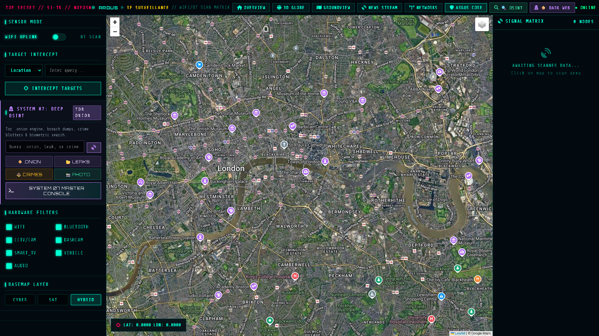
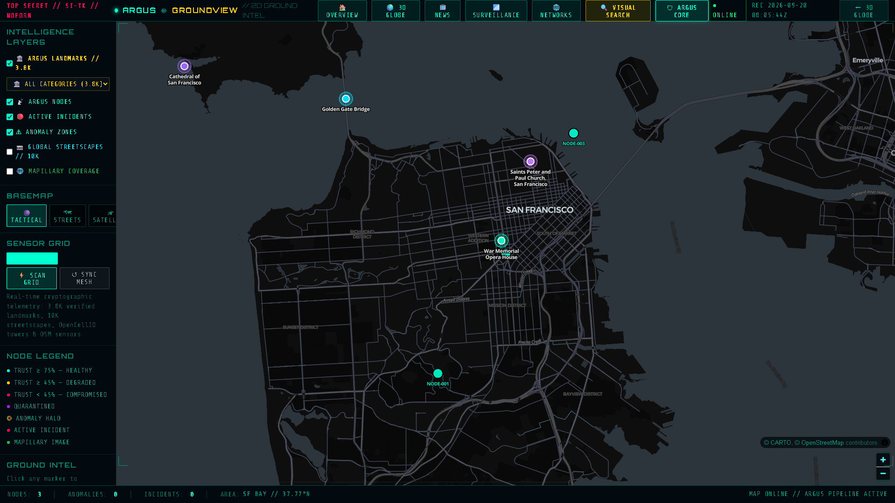

# 🔎 Criminal Record Search & Recon Manual
```
================================================================================
  [ LAW ENFORCEMENT & CRIMINAL RECONNAISSANCE PROTOCOL ]
================================================================================
```

Follow these operational procedures to execute crime searches, public record queries, and criminal reconnaissance using **GeoVigilant Argus Eye**.

---

## 🛠️ Step-by-Step Operator Guide

1. Navigate to the **RF Surveillance & Intercept** console (`/surveillance`) or open the **Search / Recon** modal from the tactical header.
2. Locate the **SYSTEM 07: DEEP OSINT** panel in the left sidebar.



3. Click the **`CRIMES`** trigger to filter databases specifically for law enforcement records and sanction lists.
4. Input target identifiers into the query input:
   * **Subject Name or Alias**
   * **Geographic Jurisdiction** (City, Postal Code, or Police Beat)
   * **Offense Classification** (Violent, Financial, Cyber, Smuggling)
5. Review correlated criminal data cards, offense timestamps, and geocoded incident coordinates.

---

## 🏛️ Ingested Data Sources

* **UK Police API**: Street-level reported crime records, outcomes, and local stop-and-search logs.
* **FBI Most Wanted**: High-priority fugitive profiles, known aliases, and biometric descriptions.
* **OpenSanctions**: Worldwide politically exposed persons (PEPs), international sanctions lists, and trade restrictions.
* **INTERPOL Red Notices**: Public international arrest warrants and fugitive notices.

---

## 🗺️ GroundView Incident Mapping

In **ARGUS GroundView** (`/ground`), localized incidents and anomaly zones are projected onto the tactical map alongside Argus IoT nodes:



* **Incident Halo Markers**: Color-coded halos indicating recent criminal activity or security perimeter violations.
* **SVI Visual Confirmation**: Operators can select adjacent SVI camera nodes to inspect the physical environment surrounding reported crime locations.

---

## 🚧 Facial Crime Search & Advanced Biometrics (Roadmap)

The **Facial Crime Search & Biometrics Analysis** engine is currently in active development. Planned capabilities include:
* Facial feature extraction via deep convolutional embeddings.
* Similarity matching against public fugitive photo databases.
* Multi-angle camera alignment using the ARGUS landmark imagery BK-tree.

To contribute or test new biometric feature models, please review [`CONTRIBUTING.md`](../CONTRIBUTING.md).

```
================================================================================
  [ END OF MANUAL ] // [ GEOVIGILANT ARGUS EYE ]
================================================================================
```
