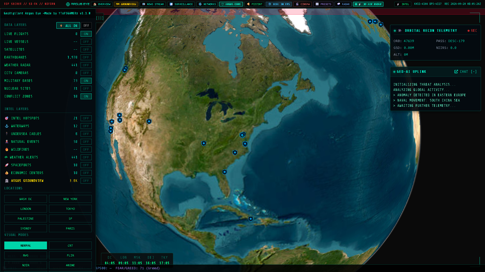

# 🤖 GeoVigilant AI: Argus GEOINT Assistant
```
================================================================================
  [ SECURE GEOINT A.I. UPLINK ] // [ ARGUS AI RECONNAISSANCE ENGINE ]
================================================================================
```

Welcome to the **GeoVigilant AI** documentation. GeoVigilant AI is an automated Geospatial Intelligence (GEOINT) and OSINT reconnaissance assistant designed to track global movements, correlate cross-source telemetry, and generate real-time operational briefings.

---

## 🚀 OVERVIEW & MISSION DIRECTIVE

GeoVigilant AI combines real-time multi-engine web data, interactive map commands, semantic vector memory (ChromaDB RAG), and large language models (LLaMA-3.1-8B-Instruct) to assist operators in analyzing global events without leaving the tactical interface.



---

## 🛠️ INTERACTION MODES

### 1. Tactical Earth HUD Integration (GEO-AI UPLINK)
Interact directly with the AI through the **Geo-AI Uplink** console on the Earth View dashboard. Hovering over any coordinate triggers localized threat assessments and telemetry updates:
* Sector threat score calculation (0–10).
* Anomaly notifications: *Naval Movement*, *Encrypted Comm Burst*, *Thermal Bloom*, or *Troop Buildup*.
* Streaming situational briefings synchronized with real-time news headlines.

### 2. ARGUS GroundView Sensor AI
In GroundView (`/ground`), the AI evaluates localized IoT mesh nodes, assesses sensor trust metrics (Healthy $\ge 75\%$, Degraded $\ge 45\%$, Compromised $< 45\%$), and flags cryptographic replay anomalies.


### 3. REST API Endpoint
Programmatic access for automated agents, Discord/Telegram bots, or external microservices:

* **Endpoint**: `POST /api/geovigilantai/chat`
* **Headers**: `Content-Type: application/json`
* **Request Payload**:
```json
{
  "message": "Track flight UAE202 and report current airspace status over Middle East",
  "web_search": true,
  "human_mode": false,
  "engine": "openrouter",
  "context": {
    "lat": 25.2048,
    "lon": 55.2708,
    "zoom": 5,
    "active_layers": ["flights", "military", "radar"]
  }
}
```

* **Response Payload**:
```json
{
  "response": "Tracking UAE202 [ICAO: 896144]. Cruising at 36,000 ft, heading 315° at 480 kts. Airspace status in Sector ME-CENTRAL is DEFCON 3. [TRACK_FLIGHT: 896144]",
  "engine_used": "openrouter/meta-llama/llama-3.1-8b-instruct",
  "web_searched": true,
  "threat_level": 3,
  "timestamp": "2026-09-18T21:45:00Z"
}
```

---

## 📜 INTERACTIVE MAP COMMAND TAGS

GeoVigilant AI directly manipulates the 3D globe viewport and 2D tactical maps by outputting structured command tags in its natural language responses:

| Command Tag | Action Performed |
| :--- | :--- |
| `[TRACK_FLIGHT: <icao>]` | ✈️ Zooms the orbital viewport to a specific aircraft by its ICAO-24 hex code. |
| `[TRACK_VESSEL: <mmsi>]` | 🚢 Zooms the orbital viewport to a specific vessel by its MMSI registration. |
| `[SHOW_WEATHER: <lat>, <lng>]` | 🌦️ Opens weather telemetry and radar precipitation for the target coordinates. |
| `[SCAN_MAP: <lat>, <lng>]` | 📡 Positions camera over coordinates and triggers a sector-wide signal scan. |
| `[SET_FILTER: <mode>]` | 👁️ Switches optical shader mode (`NORMAL`, `NVG`, `FLIR`, `CRT`, `NOIR`, `ANIME`, `SNOW`). |
| `[ZOOM_SECTOR: <name>]` | 🎯 Animates camera to a predefined strategic sector (e.g. `LONDON`, `WASH DC`, `TOKYO`). |

---

## 🔍 REAL-TIME WEB GROUNDING & MULTI-ENGINE OSINT

* **Autonomous Search Ingestion**: User queries referencing breaking events, geopolitical keywords, flight callsigns, or naval ships automatically trigger clear-net search pipelines.
* **Multi-Source Aggregation**: Synthesizes real-time results from DuckDuckGo, Bing, Google, and GDELT RSS news feeds.
* **Tor Dark Web Fallback**: On-demand dark web routing through Ahmia / local Tor proxy for onion domain resolution.

---

## 🧠 SEMANTIC MEMORY & FAILSAFE ENGINE HIERARCHY

GeoVigilant AI employs a **4-tier failsafe architecture** ensuring the intelligence assistant never goes offline:

```
[MODEL SELECTION & FALLBACK HIERARCHY]
 ├── Tier 1: Local Ollama Model (Air-gapped, zero data leakage, e.g. llama3.1, phi3)
 ├── Tier 2: Cloud OpenRouter (Meta LLaMA-3.1-8B-Instruct, high-speed reasoning)
 ├── Tier 3: Hugging Face Inference API (Serverless cloud fallback)
 └── Tier 4: Deterministic GEOINT Heuristic Engine (Offline mathematical telemetry analysis)
```

### 🧬 ChromaDB Semantic Vector Memory
Past intelligence reports, threat observations, and operator inquiries are vectorized using sentence transformer embeddings and stored in ChromaDB (`ARGUS_DATASET/chroma_db`). When an operator queries a geopolitical theater, the system retrieves relevant historical context via cosine similarity search.

```
================================================================================
  [ END OF AI SPECIFICATION ] // [ GEOVIGILANT ARGUS EYE ]
================================================================================
```
